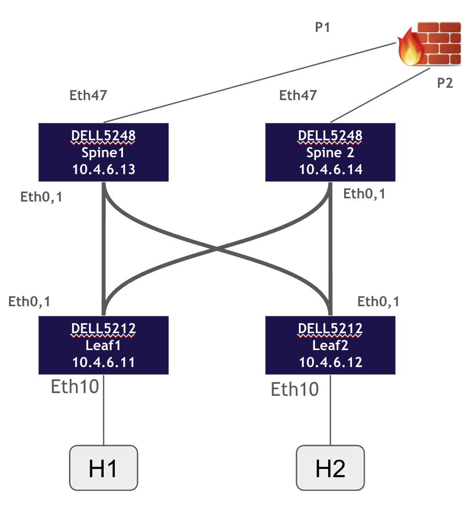

# Lab 2: sonic-agent

**Network troubleshooting and monitoring for SONiC using natural language**

This lab demonstrates how to build an AI agent that interacts with a SONiC network switch through the Model Context Protocol (MCP). You'll learn to perform network operations, troubleshoot BGP issues, manage VLANs, and monitor interface states using conversational queries.

---

## What You'll Learn

- **MCP Server Integration**: Connect to network devices using MCP server endpoints
- **Single-Device Network Operations**: Monitor and configure a SONiC switch through natural language
- **BGP Troubleshooting**: Diagnose routing issues using natural language queries
- **VLAN Management**: Configure and verify VLAN settings on the switch
- **Interface Monitoring**: Track port status, events, and state changes
- **Zero-Code Network Operations**: Perform device operations without custom tools or scripts

---

## Network Topology

The lab environment consists of a 4-device SONiC leaf-spine fabric:



**Topology Details:**
- **Spine Layer**: 2x DELL5248 switches (Spine1, Spine2)
- **Leaf Layer**: 2x DELL5212 switches (Leaf1, Leaf2)
- **Hosts**: H1 connected to Leaf1, H2 connected to Leaf2
- **Uplink**: P1/P2 firewall connected to both spines via Eth47
- **Fabric Links**: Eth0,1 interconnecting leafs and spines

**MCP Server Architecture:**
- Each SONiC switch runs a local MCP server instance
- **Agent connects to ONE switch at a time** via its MCP server endpoint
- Example configuration: `http://10.4.6.11:4321/sse` (could be any of the 4 switches)

---

## Prerequisites

### Environment Setup
See the [parent README](../README.md) for Python environment setup, NCP SDK installation, and authentication instructions.

### Lab-Specific Requirements
- SONiC MCP server running on fabric devices (pre-configured for the workshop)
- Network connectivity to MCP server endpoint (10.4.6.11:4321)
- Platform access configured (naflab2.aviznetworks.com:9001)

---

## Project Structure

```
lab-02-sonic-agent/
├── ncp.toml                    # Project metadata and MCP server configuration
├── agents/
│   └── main_agent.py           # Agent definition with minimal instructions
├── tools/
│   └── __init__.py             # Empty - no custom tools needed
├── assets/
│   └── topology.png            # Network topology diagram
├── requirements.txt            # Python dependencies
└── apt-requirements.txt        # System dependencies
```

**Key Features:**
- **Single MCP server endpoint** connects to one SONiC device at a time
- **No custom Python tools** - all operations through MCP server capabilities
- **Minimal agent instructions** - relies on MCP tool descriptions and LLM understanding

---

## Getting Started

Navigate to the lab directory and deploy the agent:

```bash
# Navigate to lab directory
cd lab-02-sonic-agent

# Authenticate with platform (if not already done)
ncp authenticate
# Platform URL: https://naflab3.aviznetworks.com:9001
# Username: your-email@example.com
# Password: NAF@2025

# Validate project structure
ncp validate .

# Package the agent
ncp package

# Deploy to platform
ncp deploy sonic-agent.ncp

# Test the agent interactively
ncp playground --agent sonic-agent --show-tools
```

Once in the playground, you can start asking questions about the connected switch!

---

## Sample Operations

### Interface Management

Monitor and manage interface states on the connected switch:

- "Show me the status of all ports"
- "What interfaces are currently down?"
- "Change the state of interface Eth10 to up"

### VLAN Configuration

Configure and verify VLAN settings:

- "Show me all configured VLANs"
- "Create VLAN 100"
- "Add interface Eth10 to VLAN 100 as a tagged member"
- "What VLANs are currently configured?"
- "Show VLAN membership for interface Ethernet10"
- "Configure VLAN 200 on this switch"
- "Which interfaces are members of VLAN 200?"

### BGP Monitoring & Troubleshooting

Diagnose routing and BGP neighbor issues:

- "Show me the BGP summary"
- "Are all BGP neighbors established?"
- "Display the routing table"
- "What BGP neighbors are currently down?"
- "Show me detailed BGP neighbor information for 10.0.0.1"
- "What is the status of BGP peer 10.0.0.2?"
- "What routes are being advertised to peer 10.0.0.2?"
- "Is there a route to 192.168.1.0/24?"

---

## Architecture

### MCP Server Integration Pattern

This agent demonstrates the **MCP server integration pattern** for network device automation:

```python
from ncp import Agent, MCPConfig

agent = Agent(
    name="sonic-agent",
    description="Network troubleshooting and monitoring agent for SONiC switches",
    instructions="""
    You are a network operations assistant for a SONiC switch.
    Use the available MCP tools to help users monitor and troubleshoot the device.
    Always confirm device operations before making configuration changes.
    """,
    tools=[],  # No custom tools needed
    mcp_servers=[
        MCPConfig(
            transport_type="sse",
            url="http://10.4.6.11:4321/sse"
        )
    ],
)
```

### Available MCP Server Capabilities

**CREATE Operations (Configuration):**
1. `interface_state` - Change interface operational state (up/down)
2. `vlan_config` - Create and configure VLANs
3. `vlan_member` - Add/remove interfaces to/from VLANs

**SHOW Operations (Monitoring):**
4. `get_iface_events` - Retrieve interface event logs
5. `show_port_status` - Display port operational status
6. `show_vlan` - Show VLAN configuration and membership
7. `show_route` - Display routing table entries
8. `show_bgp_summary` - BGP session summary
9. `show_bgp_neighbors` - Detailed BGP neighbor information

### Design Philosophy

- **Natural Language Operations**: Users describe what they want in plain English
- **Tool Orchestration**: LLM selects and chains MCP tools automatically
- **Single-Device Focus**: Agent manages one SONiC switch at a time
- **Safety Through Conversation**: Agent confirms before making changes

---

## Key Takeaways

- **MCP servers enable device integration** without building custom API clients or tools
- **Natural language abstracts complexity** of network CLI commands and YANG models
- **Single-device operations** through simple MCP server endpoint configuration
- **Zero custom code** required for sophisticated network automation
- **Troubleshooting workflows** emerge from tool combinations, not hard-coded logic
- **Agent instructions stay minimal** when MCP tool descriptions are comprehensive

---

## Next Steps

- Explore more complex troubleshooting scenarios (route analysis, neighbor diagnostics)
- Try different switches by updating the MCP server URL in `ncp.toml`
- Compare with Lab 3 (netops-agent) which demonstrates multi-system orchestration
- Experiment with adding the Charts MCP server for network visualization

---

Ready to monitor and troubleshoot your network with AI? Deploy the agent and start asking questions!
